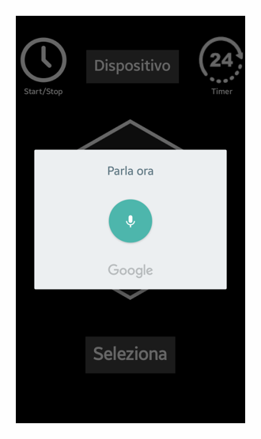

# Brief overview of the App UI

## Home Screen

App prompts the user to "connect" to the centralino. This is done by connecting through bluetooth. 

    

> In case the bluetooth is not enabled, the app will ask the user to enable it and guide to settings.

    
    

## Waiting for sync

Once the bluetooth is enabled, the app will start searching for the centralino. Once connected it will prompt the user to sync the available devices connected to the outlets. 

This is done by sending a request to the centralino to send the list of devices connected to the outlets. The centralino will respond with a list of devices. Described in detail [here](../../../Code_Rationale.md#automatic-retrieval-of-the-number-of-devices-connected-to-centralino-by-the-app).

-----------------------------------------------------
### Main screen

    

**Top left**: Alarm icon indicates the possibility to set a time for the device to turn on/off. See [Setting an alarm](#setting-an-alarm).

**Top right**: Timer icon indicates the possibility to set a timer for the device to turn on/off. See [Setting a timer](#setting-a-timer).

**Center**: Main button allows instant on/off control of the currently selected device. 

**Bottom center**: Sync button. This button will be enabled once the centralino is connected. It will allow the user to sync the devices connected to the outlets.

---------------------------------------------------

## Device selection

The app will then display the list of devices and prompt the user to select the device to control.

    

Devices available in the screehsot are `Lamp`, `Computer`, `New sync`. 

## Voice control

By holding the central button, the user can use voice commands to control the device. The app will prompt the user to speak the command.

    

## Setting a timer

    

## Setting an alarm

    

