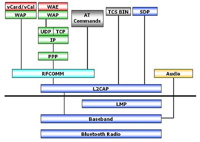

# Studio sul Bluetooth

Il Bluethoot opera a bande di frequenze assegnato circa sui 2,45 Ghz.
Per ridurre interferenze possiede 79 canali e prevede un Frequency Hopping di 1.600 volte al secondo. (Il che lo rende estremamente sicuro per le trasmissioni).
Solo uno Slave (dispositivo associato ricevente) alla volta può comunicare con il Master (dispositivo mittente) sebbene si possano connettere fino a 7 Slave ad un solo Master.

  

I collegamenti che possono essere stabiliti tra i diversi dispositivi sono di due tipi: orientati alla connessione (Connection Oriented) e senza connessione (Connectionless).
Un collegamento orientato alla connessione richiede di stabilire una connessione tra i dispositivi prima di inviare i dati;
mentre, un link senza connessione non richiede alcuna connessione prima di inviare i pacchetti.

La tecnologia Bluetooth definisce due tipi di collegamenti a supporto delle applicazioni voce e trasferimento dati: 
Un servizio asincrono senza connessione (ACL, Asynchronous ConnectionLess) 
Un servizio sincrono orientato alla connessione (SCO, Synchronous Connection Oriented).

## Stati di un dispositivo Bluetooth

Un dispositivo Bluetooth si può trovare essenzialmente in due stati: in quello di connessione o in quello di standby. L'unità si trova nello stato di connessione se è connesso ad un altro dispositivo ed è coinvolto con esso alle normali attività. Se il dispositivo non è connesso, o non è coinvolto alle attività della piconet, allora esso si trova automaticamente nello stato di standby. Questo stato è stato concepito come un modo per far risparmiare energia ai dispositivi. Se uno di essi non è coinvolto attivamente all'interno di una connessione, non c'è motivo che assorba picchi di potenza pari a quelli dei dispositivi attivi. Quando un'unità si trova in standby ascolta il canale ogni 1,28 secondi per eventuali messaggi dal master.

## Modalità di un dispositivo Bluetooth

Quando un dispositivo passa dallo stato di standby a quello di connessione, esso può essere collocato in una delle seguenti modalità:

    •  Active mode: l'unità partecipa attivamente alla piconet, sia in ricezione che in trasmissione, ed è sincronizzata al clock del master. Il master trasmette regolarmente per mantenere la sincronizzazione del sistema. Gli slave hanno un indirizzo di 3 bit AM_ADDR (Active Member Address).
    •  Hold mode: il master può mettere i dispositivi slave nello stato di Hold per un tempo determinato. Durante questo periodo nessun pacchetto può essere trasmesso dal master anche se il dispositivo mantiene il suo AM_ADDR e la sincronizzazione con il master. Questa modalità operativa è utilizzata generalmente nel momento in cui non si devono inviare pacchetti ad un dispositivo per un periodo relativamente lungo (questo ci fa capire che tale modalità operativa è supportata solamente nel caso in cui tra due dispositivi bluetooth ci sia un collegamento di tipo ACL). Durante questo periodo, il dispositivo si può spegnere per risparmiare energia. L’Hold mode può essere utilizzata anche nel caso in cui un'unità vuole scoprire o essere scoperta da altri dispositivi bluetooth o vuole partecipare ad altre piconet.
    •  Sniff mode: lo slave che passa in questo stato si trova in una modalità di risparmio energetico. Per entrare nello sniff mode, master e slave devono negoziare due parametri: uno “sniff interval” ed uno “sniff offset”. Con il primo si fissano gli slot di sniff, mentre con il secondo si determina l'istante del primo slot di sniff. Quando il collegamento entra in sniff mode, il master può inviare pacchetti solamente all'interno degli sniff slot. Quindi lo slave ascolta il canale ad intervalli ridotti. Il master può costringere lo slave ad entrare in sniff mode, ma entrambi possono chiedere il passaggio. L'intervallo di sniff mode è programmabile.
    • Park mode: il dispositivo è ancora sincronizzato alla piconet ma perde il suo indirizzo di dispositivo attivo (AM_ADDR) e riceve un nuovo indirizzo di 8 bit (PM_ADDR, Park Mode Address). Questa modalità è stata ideata per avere la possibilità di costituire piconet con più di sette slave. Infatti si possono avere fino ad massimo di 255 (28-1) dispositivi in modalità Park. Utilizzando tale indirizzo il master è in grado d'identificare un particolare dispositivo in tale modalità ed effettuare il passaggio all’active mode. Le unità in questo stato ascoltano regolarmente il traffico sulla rete per risincronizzarsi e ricevere messaggi di broadcast. Questi ultimi, infatti, sono gli unici messaggi che possono essere inviati ad uno slave in park mode. La richiesta di passaggio in park mode può avvenire indifferentemente da parte del master o dello slave. Lo slave per richiedere l'attivazione al master riceve un indirizzo di Active Request (AR_ADDR) non unico.

## Architettura delle comunicazioni Bluetooth

  

### Bluetooth Protocol Stack
Come avviene per l'architettura OSI, Bluetooth specifica un approccio a livelli nella sua struttura protocollare. Differenti protocolli sono utilizzati per differenti applicazioni. Indipendentemente del tipo di applicazione, però, lo stack protocollare Bluetooth porta sempre all'utilizzo dei livelli data-link e fisico. Non tutte le applicazioni usano tutti i protocolli dello stack Bluetooth, infatti, esso è rappresentato su più livelli verticali, al di sopra dei quali c'è un'applicazione specifica.
Scendendo un po' più in dettaglio è possibile identificare le funzioni principali svolte dai protocolli più importanti dello stack Bluetooth:
Bluetooth Radio: definisce i requisiti della parte in radio frequenza. Qui è dove i segnali radio vengono processati.

    •  Baseband: abilita il collegamento fisico tra dispositivi all'interno di una piconet. Tale livello si basa sulle procedure di inquiry e di paging per la sincronizzazione e la connessione di dispositivi bluetooth. Permette di stabilire i due diversi tipi di connessione (ACL e SCO).
    •  LMP: è responsabile dell'organizzazione del collegamento, del controllo tra dispositivi bluetooth e del controllo e negoziazione della dimensione dei pacchetti. È anche utilizzato per quanto riguarda la sicurezza: autenticazione e crittografia, generazione, scambio e controllo chiavi. Effettua anche il controllo sulle diverse modalità di gestione della potenza (park, sniff, hold) e sullo stato della connessione di un dispositivo all'interno della piconet. I messaggi LMP sono filtrati ed interpretati dal link manager in sede di ricezione, di conseguenza non saranno mai trasmessi ai livelli superiori. Questi messaggi hanno priorità maggiore rispetto ai pacchetti che trasportano dati utenti.
    •  L2CAP: esegue il multiplexing dei protocolli di livello superiore, la segmentazione e il riassemblaggio dei pacchetti e il trasporto di informazione relativa alla QoS (Quality of Service) ovvero è possibile richiedere una certa QoS da riservare ad un determinato link. L2CAP permette ai protocolli dei livelli superiori ed alle applicazioni di trasmettere e ricevere pacchetti di dati di dimensione superiore a 64 KB. Esso definisce solamente un collegamento di tipo connectionless. I canali audio di solito vengono fatti girare su collegamenti SCO; per ovviare a questo problema dati audio possono essere inviati all'interno di pacchetti di protocolli che girano su L2CAP.
    •  RFCOMM: emula una porta seriale (RS-232) sul protocollo L2CAP. Questo livello è necessario in quanto esistono applicazioni (come per esempio OBEX) che utilizzano un meccanismo di trasmissione seriale.
    •  TCS BIN: opera a livello bit e definisce i segnali di controllo per le chiamate voce e dati tra dispositivi Bluetooth e le procedure per gestire gruppi di dispositivi TCS.
    •  SDP: è un elemento importante all'interno della tecnologia Bluetooth, in quanto permette alle applicazioni di avere informazioni sui dispositivi, sui servizi offerti e sulle caratteristiche dei servizi disponibili. Dopo aver individuato il dispositivo che implementa un determinato servizio è possibile stabilire una connessione.
    •  AUDIO: la funzione di questo strato è quella di codificare il segnale audio. Due tecniche possono essere adottate: log PCM e CVSD; entrambe forniscono un flusso di bit a 64 kbit/s. La codifica log PCM (Pulse Code Modulation) consiste in una quantizzazione non uniforme a 8 bit. Nella codifica CVSD (Continuous Variable Slope Delta Modulation) il bit d'uscita indica se il valore predetto è maggiore o minore del valore della forma d'onda in ingresso, costituita da un segnale PCM con quantizzazione uniforme. Il passo è determinato dalla pendenza della forma d'onda.

Fonte : https://it.wikipedia.org/wiki/Bluetooth