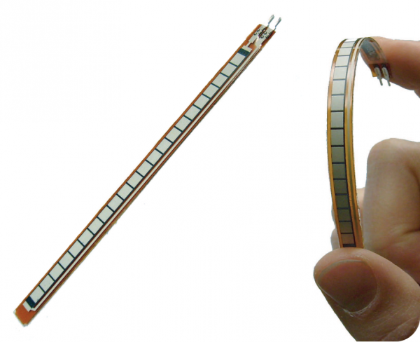
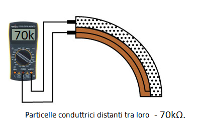
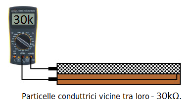
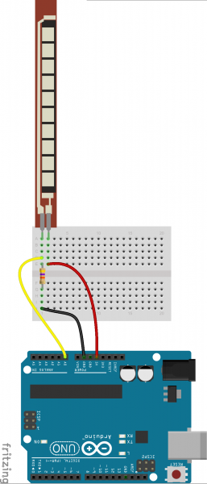

# Cosa è un "Flex sensor" e come funziona.

Un "Flex sensor" è...

Un sensore che ha la forma di una striscia sottile. Esso permette di ricevere un segnale elettrico analogico che varia in base all'angolo di curvatura del sensore. Nell'immagine sottostante esso è fotografato nel suo stato di tensione e quello di flessione.
 

<p align="center">
  
</p>

## Come funziona il "Flex sensor":

Su un lato il "Flex sensor" (sensore di flessione) è ricoperto di un inchiostro polimerico che ha particelle conduttrici in esso. Quando il sensore è teso (completamente dritto), le particelle danno all'inchiostro una resistenza di circa 30kΩ. Quando il sensore è curvo o flesso in qualsiasi modo le particelle si distanziano tra loro, aumentando la resistenza (fino a circa 50-70kΩ quando il sensore è piegato a 90°, come nel disegno sottostante).
 
Quando il sensore si tende nuovamente, la resistenza ritorna al valore originale. Misurando la resistenza, si può determinare quanto il sensore sia piegato. 
 
<p align="center">
  
</p>

<p align="center">
  
</p>


Connessioni :

•	Una resistenza dovrebbe connettere AX(Pin analogico n° X) al GND(terra).
•	 Il "Flex sensor" dovrebbe connettere AX all'erogatore di tensione 3.3V
Quanto più la resistenza sul sensore aumenta (in seguito ad una flessione), tanto più il voltaggio su AX dovrebbe dimminuire.
Nelle due immagini sottostanti si mostra come è necessario collegare un "Flex sensor" ad un microcontrollore a finché funzioni correttamente. 

<p align="center">
  
  
</p>


Dichiarazioni :

``` C++
const int FLEX_PIN = AX; // Pin analogico connesso al divisore dell'output del sensore


// Measure the voltage at 5V and the actual resistance of your 47k resistor, and enter them below:
const float VCC = 4.98; // Measured voltage of Ardunio 5V line
const float R_DIV = 47500.0; // Measured resistance of 3.3k resistor


// Upload the code, then try to adjust these values to more
// accurately calculate bend degree.
const float STRAIGHT_RESISTANCE = 37300.0; // resistance when straight
const float BEND_RESISTANCE = 90000.0; // value of resistance at 90 deg
```

Dichiarazione nel setup():
``` C++
void setup() 
{
  Serial.begin(9600);
  pinMode(FLEX_PIN, INPUT); 
}
```
Dichiarazione nel loop():
``` C++
void loop() 

{
  // Read the ADC, and calculate voltage and resistance from it
  int flexADC = analogRead(FLEX_PIN);
  float flexV = flexADC * VCC / 1023.0;
  float flexR = R_DIV * (VCC / flexV - 1.0);
  Serial.println("Resistance: " + String(flexR) + " ohms");
  // Use the calculated resistance to estimate the sensor's bend angle:
  float angle = map(flexR, STRAIGHT_RESISTANCE, BEND_RESISTANCE,0, 90.0);
//la funzione map() serve a rapportare il valore flexR tra straight_resistance(minimo) e
// bend_resistance(massimo) sulla scala tra 0(minimo) e 90(massimo) (gradi)
  Serial.println("Bend: " + String(angle) + " degrees");
  Serial.println();


  delay(500);
}
```


Fonti:

https://learn.sparkfun.com/tutorials/flex-sensor-hookup-guide#example-program
"One side of the sensor is printed with a polymer ink that has conductive particles embedded in it. When the sensor is straight, the particles give the ink a resistance of about 30k Ohms. When the sensor is bent away from the ink, the conductive particles move further apart, increasing this resistance (to about 50k-70K Ohms when the sensor is bent to 90°, as in the diagram below).
When the sensor straightens out again, the resistance returns to the original value. By measuring the resistance, you can determine how much the sensor is being bent. "

"Development environment specifics:
Arduino 1.6.7"
