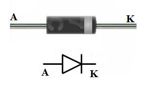

# I SEMICONDUTTORI
L'atomo usato nei semiconduttori è il silicio, un atomo tetravalente (4 elettroni di valenza), che per ciò forma legami molto forti con gli altri atomi di silicio. Per creare corrente bisogna creare un passaggio di elettroni, quindi si usa inserire atomi diversi: questo processo è chiamato drogaggio. 
Drogaggio tipo Negativo: si inseriscono elementi pentavalenti (Arsenico), così facendo vi è un elettrone in meno, che è libero. 
Drogaggio tipo Positivo: si inseriscono elementi trivalenti (alluminio), così si crea una lacuna, e gli altri elettroni vi si spostano.
# DIODO
il diodo è composto da due elementi: uno a drogaggio P (con le lacune), uno con drogaggio N (elettroni in più, negativi). Il punto di giunzione si chiama Giunzione PN. Dalla parte della P vi è l'ANODO, dalla parte della N vi è il CATODO.  

  

La resistenza è da 1KOhm. La corrente scorre dall'anodo al catodo (anche se in realtà la corrente scorre al contrario). 

## Sommario
IL DIODO SERVE A FAR SCORRERE LA CORRENTE IN UN SOLO VERSO. PASSA CORRENTE SOLO SE Va>Vk. QUANDO IN UN DIODO SCORRE CORRENTE, AI SUOI CAPI SI CREA UNA TENSIONE DI SOGLIA (0.6 – 0.7 V.)