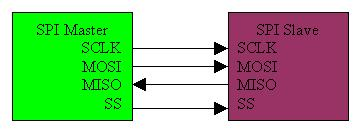
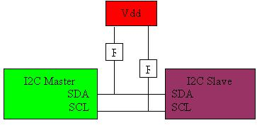

# Protocolli di trasferimento

Per rendere semplice il trasferimento di informazioni tra sensori e microcontrollori sono stati realizzati due tipologie di protocolli: I2C (Inter-Integrated Circuit) e SPI (Serial Peripheral Interface).
Entrambi i sistemi hanno i propri pro e contro che li rendono più o meno convenienti per l’applicazione data.
Le librerie di Arduino permettono di utilizzare questi protocolli con estrema facilità.
In fase progettuale la scelta del protocollo dipende dal tipo di dispositivo che si vuole utilizzare. Sicuramente potrete trovare in commercio dispositivi che permettono di utilizzare entrambi i protocolli ma è più comune trovare dispositivi che supportano un solo standard.

## DIFFERENZE TRA SPI E I2C
SPI supporta la comunicazione full-duplex con un throughput molto più alto rispetto ad I2C. non è limitato a parole di 8 bit, in modo da poter inviare messaggi di ogni genere e con contenuti e scopi arbitrari. L’interfaccia SPI non richiede resistenze di pull-up, il che si traduce in un minore consumo di energia. Tuttavia, I2C è più semplice avendo meno linee il che significa che meno piedini sono richiesti per interfacciarsi ad un circuito intergrato. Quando si comunica con più di un dispositivo slave, I2c possiede il vantaggio di un indirizzamento in banda (a noi non interessa), al posto di avere una linea chip select per ogni slave. I2c supporta inoltre lo slave acknowledgment che significa che si è certi del dispositivo con cui si sta comunicando. Con SPI, un master può inviare dati a vuoto e non saperlo. In generale SPI è consigliato per applicazioni che comunicano lunghi flussi di dati e non solo parole come locazioni di memoria.
Lunghi flussi di dati sono presenti in applicazioni in cui si lavora con un processore di segnali digitali o con un ADC, per esempio, SPI sarebbe perfetto per riprodurre dell’audio memorizzato in una eeprom e riprodotto attraverso un convertitore digitale analogico. Inoltre, dato che SPI supporta elevate dimensioni di dati in confronto a I2C, soprattutto grazie alla sua capacità duplex, è molto raccomandato per applicazioni veloci, che raggiungono le decine di MegaHertz. Inoltre dato che non ci sono dispositivi per l’indirizzamento sviluppati per SPI il protocollo è molto più difficile da usare nel caso di più dispositivi slave. Questo significa che quando si utilizzano più di un nodo, in genere utilizzare I2C è consigliato

## INTERFACCIA SPI

  

come si può vedere nella figura, SPI ha 4 linee. La linea SCLK è la linea di clock, il clock è generato dal master e scandisce la comunicazione in entrambe le direzioni, e questa linea è un ingresso per tutti gli slave. MOSI è la linea master output slave input e porta i dati dal master verso lo slave. La linea MISO è l’opposto, prende l’output dello slave e lo indirizza al master. Per finire la linea SS conosciuta anche come CS è utilizzata per selezionare lo slave a cui trasferire i dati. Di solito la sequenza di trasferimento consiste nel porre a livello basso la linea SS con un piedino di I/O generico, inviare un numero di X segnali di clock con la giusta polarità e fase, porre a livello alto la linea SS per terminare la comunicazione.
I dati sono trasmessi in entrambe le direzioni, per cui in un sistema “transmit only” i byte ricevuti saranno scartati e in un sistema “receive only” deve essere mandato un byte fittizio. Bisogna aver cura di non invertire la il segnale SS durante la comunicazione siccome questo introdurrà errori. La polarità e il controllo della fase del clock avvengono su ogni fronte del segnale di clock in cui i dati sono ricevuti o inviati. Deve essere settato per coincidere tra master e slave. Esiste inoltre una versione di SPI 3-wire che tuttavia supporta solo la comunicazione half duplex. Questa implementazione usa una linea SISO, questa linea bidirezionale singola trasporta i dati in entrata e in uscita dallo slave. Questa modalità ha una tendenza a non essere supportato dai microcontroller ma può essere facilmente implementato via software.

## I2C

  

 

I2C consiste di due linee bidirezionali che sono tenute alte a Vdd. La linea SDA corrisponde ai dati seriali e SCL è il clock seriale. I moduli standard I2C supportano indirizzi slave a 7 bit e supportano fino a 112/128 nodi, alcuni moduli estesi supportano indirizzamenti slave a 10 bit, tuttavia tutti i moduli sono limitati ad una capacità di bus di 400pF. Le velocità standard si aggirano intorno ai 10kbps per la modalità Low-speed 100kbps nella modalità Fast plus, e 3.4Mbps nella modalità Hi-speed. I tre tipi di messaggi definiti dal protocollo I2C sono un singolo messaggio che il master scrive ad uno slave, un singolo messaggio che il master legge da uno slave e un messaggio combinato dove il master dispone almeno due letture e/o scritture ad uno o più slave.
La sequenza di comunicazione inizia con il master che invia un bit di start seguito dall’indirizzo dello slave a 7 o 10 bit e infine un bit che seleziona l’operazione: 1 per leggere e 0 per scrivere. A questo punto, se l’indirizzo dello slave esiste sul bus, lo slave invierà un bit di acknowledgment al master. I data sono dunque trasmessi sulla linea SDA nella direzione specificata dal master. Un bit di acknowledgment viene mandato alla fine della trasmissione di ogni byte fino al ricevimento della fine della trasmissione. L’unica eccezione si ha quando il master è in modalità ricevimento e lo slave in modalità trasmissione il master non invierà nessun bit di acknowledgment dopo l’invio dell’ultimo bit ricevuto. In ultimo la comunicazione viene terminata con il master che invia un comando di stop.
I comandi di start e stop altro non sono che semplici transizioni dall’alto al basso (start) sulla linea SDA con SCL alta, o dal livello basso al livello alto (stop) sulla linea SDA con SCL a livello alto. Le transizioni per i bit di dati sono sempre eseguite quando la linea SCL è bassa; lo stato alto è solo per i comandi di start e stop.
Fortunatamente questo fornisce una conoscenza migliore di questi due protocolli, e le loro differenze. Dovrebbe essere molto più semplice scegliere tra i due per un’applicazione data. Ma la vita non è così semplice, bisogna comunque considerare se altri tipi di comunicazione non si addicono bene per l’applicazione sarebbe meglio ancora non utilizzare affatto un protocollo seriale ma utilizzare un tipo di comunicazione parallela.

Fonti: 
http://www.maffucci.it/2015/10/03/esercizio-arduino-in-60-minuti-usare-un-display-oled/
http://it.emcelettronica.com/comunicazione-seriale-i2c-o-spi-quale-usare

