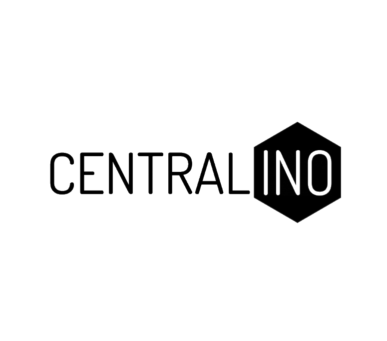
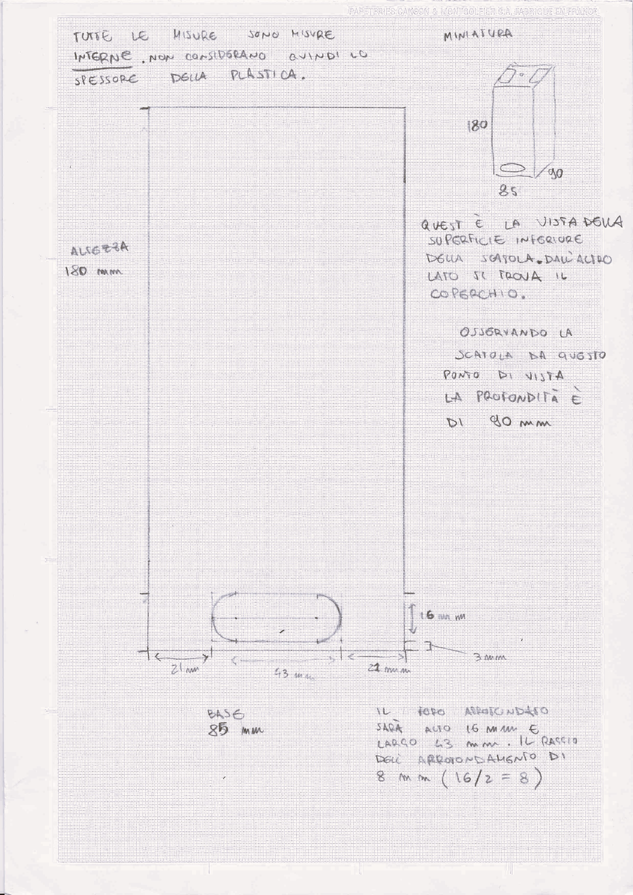
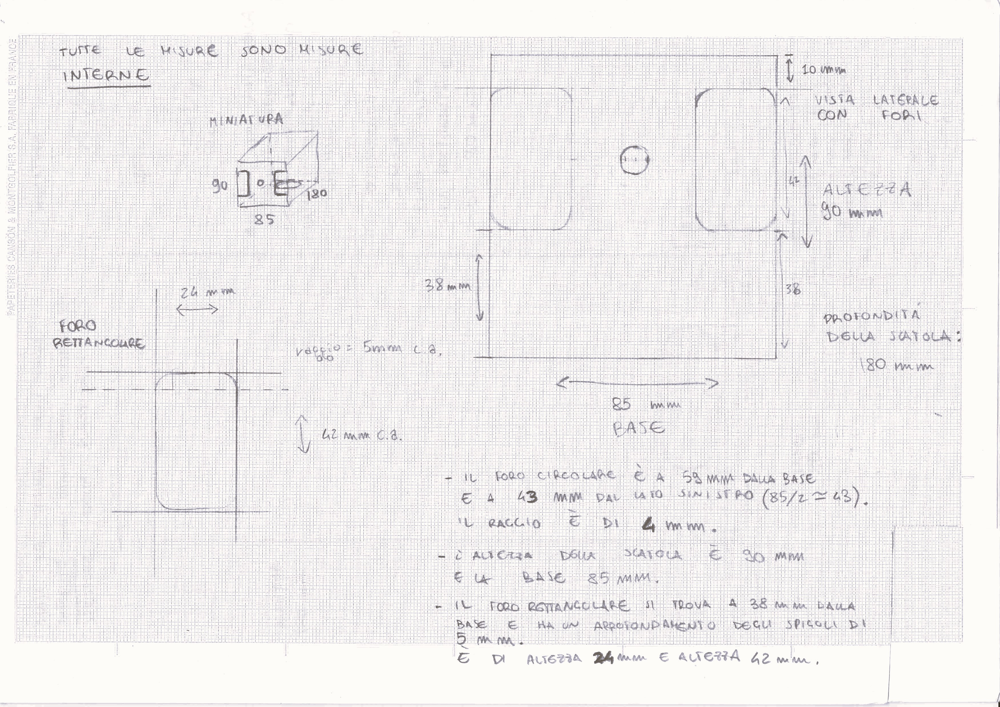
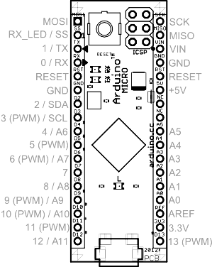
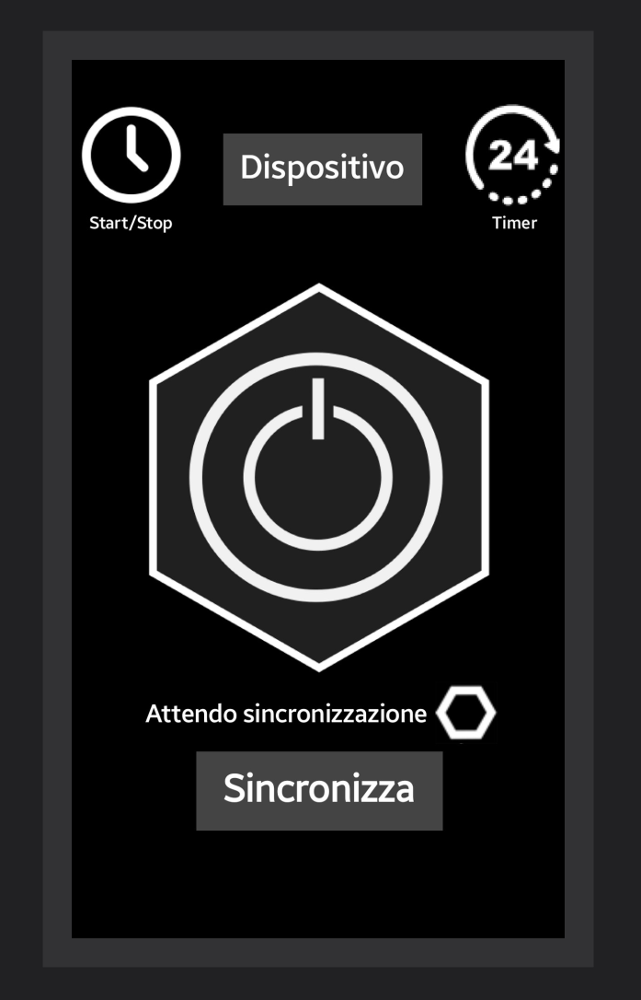
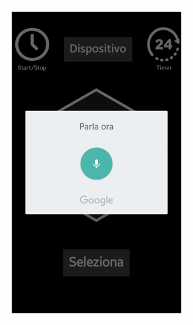

 
<i>Your world in your hands.</i>

> **Arduino-powered device** for _near-field_ **remote control of multiple power outlets**. 
> 
> The device can be programmed and scheduled with timers thanks to its internal clock. 
> 
> It can be **easily configured using its Android app** counterpart, which is designed for devices operating with Android provided of a _bluetooth transmitter_.
> 
> The app also supports **voice commands** with a very simple syntax.

# CENTRALINO

Last modified: 19th June 2017

**Project reference fields:** 

`Novel Technologies`, `Internet of Things (IoT)`, `Home Automation`.

## Hi, I'm Filippo 👋
This is a very old project of mine, it was born in January 2017 and concluded in June the same year. 
This was my first project in the field of electronics and programming.
I was 17 years old and I guess you can tell I was a bit naive, but I was very passionate about it and I still am.

This project has many flaws, but it was a great learning experience, I'm quite fond of it, so I decided to share it here as something to remember. 

Something that will always suggest how ...

<b>...every long journey begins with a first step.</b>

------------------------------------------------------
##### Small note on language 🇮🇹 🇬🇧:
The project was born in Italian, so unfortunately many of the comments in the code as well as documentation and the report are in Italian.
I apologize for this, but I hope that the code is still understandable and that the documentation is still useful (maybe with the help of a translator).

**I decided to have at least the README in English, so that the core of the project as well as the repository structure is understandable to everyone**.

**I also decided to translate a part of the report, concerning the code structure and rationale.**

Such translated document can be found [here](Code_Rationale.md).

**I also translated the Android app presentation concerning the App GUI.** 

Such translated document can be found [here](Design/Android_Centralino/Screenshots/Presentation.md).

## Idea and objective:

The project was born with the purpose of making residential and working complex more connected to the people who inhabit it. The project aims to enhance humans environmental control. 
CENTRALINO is designed to control electrical devices such as household appliances, electric, air conditioners, heating systems, and similar.

An increased control can change a person's experience with the surrounding world. The CENTRALIzation of automation is sometimes not just a convenience but a necessity, e.g. in case of subjects with disabilities. 

"Smart homes" are a topic that companies are vigorously addressing to offer increasing automation and integration between systems and services. 
Home automation involves a complex mix of various technologies and requires strong interdisciplinary collaboration.

### The project aims to:

 - Enhance security of electrical devices populated environments.
 - Reduce operating costs.
 - Convert old environments and old systems into more dynamic ones.
 - Simplify the design, installation, maintenance, and use of technology.
 - As a whole: improve the quality of life.

## Description of the project:

The project is named "CENTRALINO" (Italian for "switchboard"), the name reflects its function of both **centralizing** and **managing** control, much like in telecommunications.

CENTRALINO is a device that allows remote control of multiple power outlets with the possibility to be programmed and scheduled at specific intervals using an internal clock.

The device is easily configured with mobile devices such as phones, tablets, or computers. The latter only needs to run an Android OS and be provided of a Bluetooth transmitter.

## Functions of the device:

Currently, there are three main functions, but the **most important aspect** is that there is an **infrastracture basis that anyone can use to develop their own custom functions** or also implement **new communication protocols**.

1. **Instant On/Off** - Instantaneous switching on and off of the selected device (which means indirect control on its power outlet). 

2. **On/Off with alarm** - Similar to the previous function, but with the possibility of specifying a time at which the device will be turned on or off.

    To do so the device uses the RTC (Real-Time Clock) to compare CENTRALINO's time with the user-set "alarm" time.

3. **On/Off with a timer** - Similar to the previous function, but with the possibility of specifying a duration after which the device will be turned off.

>**Q: How is the CENTRALINO device set to the current time?** 
>
>**A:** It receives the timer duration in minutes from the Android app counterpart and sets the RTC accordingly.

------------------------------------------------------

# Repository structure

    .
    |
    ├── Information_Gathering
    │   ├── Documents                           # Documents concerning components working principles
    │   │    ├── Bluetooth                      # Code snippets and protocol description of bluetooth communication
    │   │    ├── Infra_Red                      # Semiconductor and diodes working principles
    │   │    ├── Transfer_Protocols             # I2C and SPI protocols description
    │   │    └── Flex_sensor                    # Flex sensor working principles
    │   │
    │   └── Multimedia                          # Pin configuration for different hardware components
    │        ├── ...
    │        └── ...
    │
    ├── Design                                  # Design files
    │   ├── Android_Centralino                  # Android app files and latest version apk 
    │   ├── Logo                                # Logo images
    │   └── Software                            # Arduino code files
    |       ├── CLIENTino_versions              # CENTRALINO code versions
    |       ├── Librerie                        # Arduino libraries
    |       └── ...
    │      
    └── Project_Report                          # Final report of the project
        ├── Presentazione_applicazione.pdf      # Android app presentation
        ├── Relazione progetto CENTRALINO.pdf   # Project report
        └── ...

## Information gathering on components: 🔧🔩

I used to create small documentation files for each component and some of them are here listed:

- [Bluetooth Coding](/Information_Gathering/Documents/Bluetooth/Bluetooth_coding.md)
- [Bluetooth](/Information_Gathering/Documents/Bluetooth/Bluetooth_study.md)
- [InfraRed and semiconductors](/Information_Gathering/Documents/Infra_Red/Semiconduttori.md)
- [Transfer Protocols](/Information_Gathering/Documents/Transfer_Protocols/Transfer_protocols.md)
- [Flex Sensor](/Information_Gathering/Documents/Flex_sensor/Flex_sensor.md)

## Design: 📐

Here is possible to find the latest version of the Android app and the Arduino code.

- [Android app](/Design/Android_Centralino/App_builds/STABLE_CENTRALINO1_3.apk) 📱
    - Overview of the App GUI is available [here](/CENTRALINO_BETA/Design/Android_Centralino/Screenshots/Presentation.md)
    - Overview of the App code structure is available [here](Code_Rationale.md#rationale-behind-the-android-app-code-structure)

- [Arduino code](/Design/Software/CLIENTino_versions/CLIENTinoPRESENTATION1_1/CLIENTinoPRESENTATION1_1.ino) ⚙
    - Overview of the Arduino code structure is available [here](Code_Rationale.md#rationale-behind-the-arduino-code-structure)

## Project report: 📝

The project report is available [here](/Project_Report/Relazione%20progetto%20CENTRALINO.pdf) (in Italian).

The android app presentation is available [here](/Project_Report/Presentazione_applicazione.pdf) (in Italian).

------------------------------------------------------

# Implementation 

## Tools used (Software).

 - **Fritzing**: is a free software for electronic design, focused on the transition from simple prototypes to the printed circuit board to be sent to production. Useful for designing the prototype of the circuit even before it is built.
 - **Arduino IDE**: is the integrated development environment (Integrated Development Environment) of Arduino, it is a multiplatform application in Java used to compile the code with which the microcontroller that manages the sensors and other components is programmed.
 - **MIT App Inventor (Framework)**: is a web application created by Google but now owned by the Massachusetts Institute of Technology. A development environment useful for creating applications for personal use.
 - **BlueStacks**: is an application created by the American company BlueStacks Systems Inc. in 2011. BlueStacks App Player is an android app emulator for MacOS and Windows operating systems. The main features are the fully customizable environment, support for multiple operating system configurations and integration with Google Play.

 ## System architecture

A user can connect to CENTRALINO with the appropriate software application simply via Bluetooth. 
  
### The final system will be based on the presence of three characters:

  - **USER**: connects via bluetooth to the devices.
  - **CENTRALINO**: controls the power outlet.
  - **CENTRALINO-SERVER**: enables the user to control all the associated CENTRALINO (CLIENTs) without ever having to disconnect from CENTRALINO SERVER, which will take care of managing the communications with the others.

    The latter has not been created yet. However, by adding a communication layer on top of the current one with very little effort, it would be possible to create a network of CENTRALINO devices that operate synchronously under the control of a single central server.

------------------------------------------------------

## Tools used (Hardware):

 - Welder.
 - Cellulose adhesive tape.
 - Screwdrivers.
 - Solder wire.
 - Liquid silicone.

## Components used (Hardware):

     • Jumpers for solderless male-male connections.
     • Bread Board for experimental prototypes of solderless circuits.
     • Infrared receiver.
     • Buttons/Buttons.
     • Bluetooth transceiver module – module for Bluetooth transmission and reception.
     • Micro SD Mini Slot – Module for connection with a micro SD card for data storage.
     • Assortment of resistors from 1 to 10 M Ohm (Ω).
     • RTC (Real Time Clock) Real Time Clock – module with battery.
     • Micro ATmegax32u4 powered by 5V (microcontroller).

## Cost of components:

Prices are taken from the following sites:
     - AliExpress: is a branch of the "Alibaba Group" company that unites Chinese companies and offers a retail service to an international market, mainly targeting European buyers. It is the supplier of our components.

     • Jumpers = 120 pieces for €2.39.
     • Bread Board = 2 pieces for €0.74.
     • Infrared LEDs = 20 pieces for €1.25.
     • IR receiver = 10 pieces for €0.73.
     • Buttons/Buttons = 100 pieces for €1.44.
     • RTC (Real Time Clock) = 1 piece for €1.20.
     • Micro ATmegax32u4 = 3 pieces for €4.59 each.
     • Micro SD Mini slot = 2 pieces for €0.47 each.
     • Assortment of resistors = 300 pieces for €1.62.
     • Bluetooth HC-06 module = 2 pieces for €2.73 each.
     • 2-channel relay module (Sain Smart) = 1 piece for €9.00.

TOTAL = 

    2.39 * 1 + 0.74 * 2 + 1.25 * 1 + 0.73 * 1 + 1.44 * 1 + 1.20 * 1 + 4.59 * 3 + 0.47 * 2 + 1.62 * 1 + 2.73 * 2 + 9.00 * 1
= €40.88

> Actually not all the components are strictly necessary, but they were bought in order to have some spare parts in case of damage or malfunction.

#### Enclosure

    • Box = 1 piece for €7.00.

Produced by a local company: Tomea Plastiche.

The enclosure is a box made of plexiglass, a material that is aesthetically pleasing, partially fireproof and relatively easy to work with. Wood and metal were excluded, the first for its predisposition to fire and the second for its well-known electrical conductivity.

### Implementation specifications

In order to be able to implement the device in a larger system, the device only needs a connection to the mains powered at 220 V (Volts) (such as the domestic power grid) and a current voltage not exceeding 15 A (Ampere) to avoid damaging the circuit or incurring a malfunction of the device. 

------------------------------------------------------

### Further development

Possibly in the future the CENTRALINO server may be provided with a wirless antenna in order to communicate with a router, which in turn communicates with the user, possibly via the internet. However, this poses a problem of security and privacy. 

### Known issues:

 #### Concerning the Instant On/Off function:
For greater safety, future security measures should be implemented to prevent continuous switching on and off of the same outlet to avoid damaging the connected devices and the microcontroller itself.

 #### Concerning voice commands:
The voice commands syntax is very simple, but it is also very limited. It is not possible to deviate even just a little without incurring in unrecognized commands. This is due to the total absence of natural language processing, which in 2017 I dint know how to implement.

 #### Concerning InfraRed communication:
The code structure of the device is able to eventually support infrared communication, but it is not implemented yet to the same extent as Bluetooth. Only basic functions are implemented such as instant on/off of a single outlet. However the physical circuitry is designed to support it and the code structure is ready to be expanded.