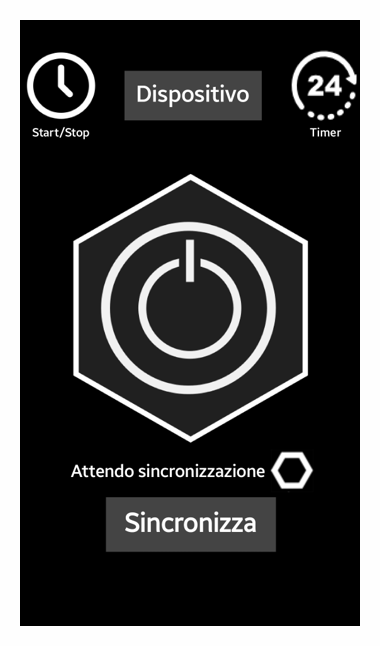

> **Arduino-powered device** for _near-field_ **remote control of multiple power outlets**. 
> 
> The device can be programmed and scheduled with timers thanks to its internal clock. 
> 
> It can be **easily configured using its Android app** counterpart, which is designed for devices operating with Android provided of a _bluetooth transmitter_.
> 
> The app also supports **voice commands** with a very simple syntax.

# CENTRALINO
_Your world in your hands._

Last modified: 19th June 2017

## Hi, I'm Filippo 👋
This is a very old project of mine, it was born in January 2017 and concluded in June the same year. 
This was my first project in the field of electronics and programming.
I was 17 years old and I guess you can tell I was a bit naive, but I was very passionate about it and I still am.

This project has many flaws, but it was a great learning experience, I'm quite fond of it, so I decided to share it here as something to remember. 

Something that will always suggest how ...

<b>...every long journey begins with a first step.</b>

------------------------------------------------------
##### Small note on language 🇮🇹 🇬🇧:
The project was born in Italian, so unfortunately many of the comments in the code as well as documentation and the report are in Italian.
I apologize for this, but I hope that the code is still understandable and that the documentation is still useful (maybe with the help of a translator).
However, I decided to have at least the README in English, so that the core of the project as well as the repository structure is understandable to everyone.

## Project reference sector.
Novel Technologies, Internet of Things (IoT), Home Automation.

## Idea and objective:

The project was born with the purpose of making residential and working complex more connected to the people who inhabit it. The project aims to enhance humans environmental control. 
CENTRALINO is designed to control electrical devices such as household appliances, electric, air conditioners, heating systems, and similar.

An increased control can change a person's experience with the surrounding world. The CENTRALIzation of automation is sometimes not just a convenience but a necessity, e.g. in case of subjects with disabilities. 

"Smart homes" are a topic that companies are vigorously addressing to offer increasing automation and integration between systems and services. 
Home automation involves a complex mix of various technologies and requires strong interdisciplinary collaboration.

### The project aims to:

 - Enhance security of electrical devices populated environments.
 - Reduce operating costs.
 - Convert old environments and old systems into more dynamic ones.
 - Simplify the design, installation, maintenance, and use of technology.
 - As a whole: improve the quality of life.

## Description of the project:

The project is named "CENTRALINO" (Italian for "switchboard"), the name reflects its function of both **centralizing** and **managing** control, much like in telecommunications. 
It is a device that allows remote control of multiple power outlets with the ability to be programmed and scheduled at specific intervals using an internal clock. The device is easily configured with mobile devices such as phones, tablets, or computers. The latter only needs to support applications designed for Android operating systems and have a Bluetooth transmitter.

## Functions of the device:

Currently, there are three main functions, but the most important aspect is that there is a foundation that anyone can use to develop their own custom functions. 

1. **Instant On/Off** - Instantaneous switching on and off of the selected device (which means indirect control on its power outlet). 

2. **On/Off with alarm** - Similar to the previous function, but with the possibility of specifying a time at which the device will be turned on or off.

    To do so the device uses the RTC (Real-Time Clock) to compare CENTRALINO's time with the user-set "alarm" time.

3. **On/Off with a timer** - Similar to the previous function, but with the possibility of specifying a duration after which the device will be turned off.

>**Q: How is the CENTRALINO device set to the current time?** 
>
>**A:** It receives the timer duration in minutes from the Android app counterpart and sets the RTC accordingly.

------------------------------------------------------

# Repository structure

    .
    |
    ├── Information_Gathering
    │   ├── Documents                           # Documents concerning components working principles
    │   │    ├── Bluetooth                      # Code snippets and protocol description of bluetooth communication
    │   │    ├── Infra_Red                      # Semiconductor and diodes working principles
    │   │    ├── Transfer_Protocols             # I2C and SPI protocols description
    │   │    └── Flex_sensor                    # Flex sensor working principles
    │   │
    │   └── Multimedia                          # Pin configuration for different hardware components
    │        ├── ...
    │        └── ...
    │
    ├── Design                                  # Design files
    │   ├── Android_Centralino                  # Android app files and latest version apk 
    │   ├── Logo                                # Logo images
    │   └── Software                            # Arduino code files
    |       ├── CLIENTino_versions              # CENTRALINO code versions
    |       ├── Librerie                        # Arduino libraries
    |       └── ...
    │      
    └── Project_Report                          # Final report of the project
        ├── Presentazione_applicazione.pdf      # Android app presentation
        ├── Relazione progetto CENTRALINO.pdf   # Project report
        └── ...

## Information gathering on components: 🔧🔩

I used to create small documentation files for each component and some of them are here listed:

- [Bluetooth Coding](/Information_Gathering/Documents/Bluetooth/Bluetooth_coding.md)
- [Bluetooth](/Information_Gathering/Documents/Bluetooth/Bluetooth_study.md)
- [InfraRed and semiconductors](/Information_Gathering/Documents/Infra_Red/Semiconduttori.md)
- [Transfer Protocols](/Information_Gathering/Documents/Transfer_Protocols/Transfer_protocols.md)
- [Flex Sensor](/Information_Gathering/Documents/Flex_sensor/Flex_sensor.md)

## Design: 📐

Here is possible to find the latest version of the Android app and the Arduino code.

- [Android app](/Design/Android_Centralino/App_builds/STABLE_CENTRALINO1_3.apk) 📱

- [Arduino code](/Design/Software/CLIENTino_versions/CLIENTinoPRESENTATION1_1/CLIENTinoPRESENTATION1_1.ino) ⚙

## Project report: 📝

The project report is available [here](/Project_Report/Relazione%20progetto%20CENTRALINO.pdf) (in Italian).

The android app presentation is available [here](/Project_Report/Presentazione_applicazione.pdf) (in Italian).

------------------------------------------------------

# Implementation

## Tools used (Software).

 -  Fritzing: is a free software for electronic design, focused on the transition from simple prototypes to the printed circuit board to be sent to production. Useful for designing the prototype of the circuit even before it is built.
 - Arduino IDE: is the integrated development environment (Integrated Development Environment) of Arduino, it is a multiplatform application in Java used to compile the code with which the microcontroller that manages the sensors and other components is programmed.
 - Python interpreter: It is a high-level, object-oriented, suitable programming language, among other uses, for developing distributed applications, scripting, numerical computation and system testing. Useful for writing and running programs for Windows, Android and a selected distribution of Linux.
 - Android AppInventor: It is a web application that allows you to create applications for Android operating systems using a graphical interface. Useful for creating the application that will be used to control the device. 

## Tools used (Hardware):

 - Welder.
 - PonD.
 - Cellulose adhesive tape.

## Components used (Hardware):

     • Jumpers for solderless male-male connections.
     • Bread Board for experimental prototypes of solderless circuits.
     • Infrared emitting LEDs.
     • Infrared receiver.
     • Buttons/Buttons.
     • Bluetooth transceiver module – module for Bluetooth transmission and reception.
     • Micro SD Mini Slot – Module for connection with a micro SD card for data storage.
     • Assortment of resistors from 1 to 10 M Ohm (Ω).
     • RTC (Real Time Clock) Real Time Clock – module with battery.
     • Micro ATmegax32u4 powered by 5V (microcontroller).

## Cost of components:

Prices are taken from the following sites:
     - AliExpress: is a branch of the "Alibaba Group" company that unites Chinese companies and offers a retail service to an international market, mainly targeting European buyers. It is the supplier of our components.

     • Jumpers = 120 pieces for €2.39.
     • Bread Board = 2 pieces for €0.74.
     • Infrared LEDs = 20 pieces for €1.25.
     • IR receiver = 10 pieces for €0.73.
     • Buttons/Buttons = 100 pieces for €1.44.
     • RTC (Real Time Clock) = 1 piece for €1.20.
     • Assortment of resistors = 300 pieces for €1.62.
     • Bluetooth = 2 pieces for €2.73 each.
     • Micro SD Mini slot = 2 pieces for €0.47 each.
     • Micro ATmegax32u4 = 3 pieces for €4.59 each.

TOTAL = 

    2.39 * 1 + 0.74 * 2 + 1.25 * 1 + 0.73 * 1 + 1.44 * 1 + 1.20 * 1 + 1.62 * 1 + 2.73 * 2 + 0.47 * 2 + 4.59 * 3 
= €30.92

------------------------------------------------------

### Known issues:

Concerning the Instant On/Off function:
For greater safety, future security measures should be implemented to prevent continuous switching on and off of the same outlet to avoid damaging the connected devices and the microcontroller itself.

Concerning voice commands:
The voice commands syntax is very simple, but it is also very limited. It is not possible to deviate even just a little without incurring in unrecognized commands. This is due to the total absence of natural language processing, which in 2017 I dint know how to implement.

Concerning InfraRed communication:
The code structure of the device is able to eventually support infrared communication, but it is not implemented yet. However the physical circuitry is designed to support it.

------------------------------------------------------

TO ADD AOOOOOOOOOOOOOOOOOOOOOOOOOOOOOOOOOOOOOOOOOOOOOOOOOOOOOOO
CONTROLLA ANCHE SUL REPORT DI AVER MESSO TUTTO QUANTO
    5. Interfaccia utente
        5.1. L'interfaccia utente del dispositivo è prettamente manuale, è possibile solo la disattivazione completa di esso tramite il pulsante blu all'interno della scatola contenitrice. Il dispositivo è programmabile ed è possibile interagire con esso solo con l'applicazione software apposita a meno che non lo si voglia spegnere tramite il suddetto pulsante interno.
    6. Elenco componenti
Nome
Venditore
Prezzo (€)
Breve descrizione
Modulo relay da 2 canali
Sain Smart
9.00
Modulo per il controllo del flusso di corrente.
Arduino Micro
Ali-express
4.50
Microcontrollore
Modulo Bluetooth HC-06
Ali-express
5.20
Modulo per la trasmissione senza fili Bluetooth
Modulo RTC (Real Time Clock)
Ali-express
3.50
Modulo orologio indipendente e autonomo (alimentato a batteria)
Scatola 
Tomea plastiche
7.00
Scatola contenitrice.
Tabella 1
    7. Scelta dei componenti e preventivo
        7.1. I componenti hanno uno scopo prototipale, non si esclude affatto la futura rielaborazione e nuova creazione di una lista di componenti più specifici.
        7.2. La scatola contenitrice è appositamente stata realizzata in plexiglass perché è il materiale che più si avvicina alla necessità di un materiale esteticamente accattivante, parzialmente ignifugo e relativamente facilmente realizzabile. Sono stati esclusi legno e metallo, il primo per la sua predisposizione al fuoco e il secondo per la sua nota conduttività elettrica.
        7.3. Il preventivo per la realizzazione dello stesso progetto è di 29.2 € per quanto riguarda la componentistica che è stata utilizzata. Supponendo una produzione in serie il prezzo calerebbe drasticamente. Una delle forze infatti del progetto stesso è anche il basso costo di costruzione che esso richiede.
    8. Simulazioni
        8.1. Sono state effettuate delle simulazioni in ambienti controllati e sicuri con esiti positivi, testando tutte le funzionalità di CENTRALINO.

    3. Architettura di sistema
        3.1. Un utente può collegarsi a CENTRALINO con l'apposita applicazione software semplicemente tramite le impostazioni Bluetooth offerte dall'applicazione stessa. Una volta che l'utente si connette ad esso, per controllarne un altro dovrà prima disconnettersi da quello a cui è già collegato. Il sistema finale si baserà sulla presenza di tre personaggi :
            ▪ Utente controllore (utilizza applicazione software descritta nella sezione successiva della relazione) che impartisce i comandi ai dispositivi.
            ▪ CENTRALINO (descritta in questa parte della relazione) che controlla la presa di corrente.
            ▪ CENTRALINO-SERVER (non descritta in questa relazione ma di cui è prevista la futura creazione) che da la possibilità all'utente di controllare tutti i CENTRALINO associati senza mai doversi disconnettere da CENTRALINO SERVER che provvederà lui stesso a gestire le comunicazioni con gli altri. 
    4. Specifiche implementative
        4.1. Per funzionare ed essere implementato in un sistema più grande il dispositivo necessità solamente di una connessione alla rete elettrica alimentata a 220 V (Volt) (come ad esempio la rete elettrica domestica) ed una tensione di corrente non superiore a 15 A (Ampere) per non rischiare di danneggiare il circuito o incorrere in un malfunzionamento del dispositivo. 

AI SOFTWARE 

                ◦ MIT App Inventor (Framework): è una applicazione web creata da Google ma ora posseduto dal Massachusetts Institute of Technology. Un ambiente di sviluppo utile a creare applicazioni per android di uso personale.
        ◦ BlueStacks : è un'applicazione creata dall'azienda americana BlueStacks Systems Inc. nel 2011. BlueStacks App Player è un emulatore di app android per i sistemi operativi MacOS e Windows. Le caratteristiche principali sono l'ambiente completamente personalizzabile, il supporto per molteplici configurazioni di sistema operativo e l'integrazione con Google Play.

STA ROBBA
    3. Strumenti utilizzati (Hardware):
        ◦ Saldatore.
        ◦ Cacciaviti vari.
        ◦ Stagno.
        ◦ Silicone liquido.
        ◦ Strumenti di misura di precisione.